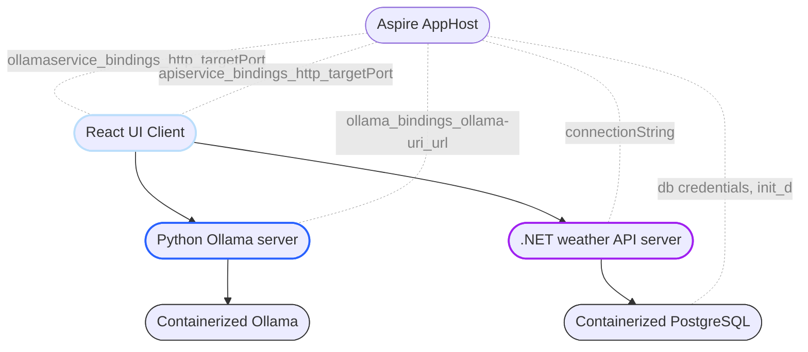
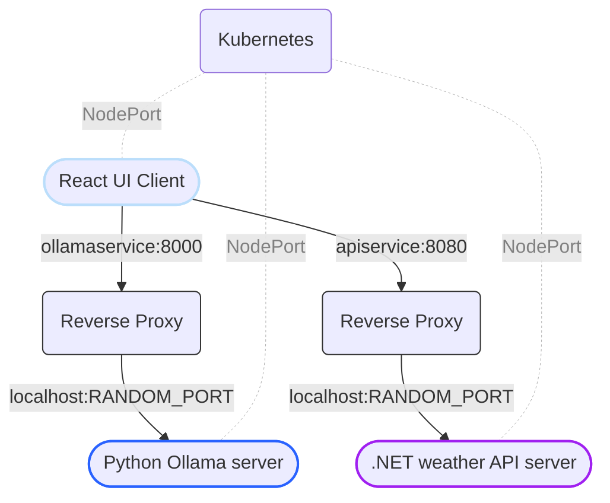

> In this article, we will learn how to create a microservices application using Azure Aspire, a code-level orchestrator tool. I built and deployed a microservices application on a local Kubernetes context, which includes:
> 
> 1) a containerized Ollama service with a Python wrapper server,
>
> 2) a .NET-textbook-material weather forecast server with an attached containerized PostgreSQL database, and
>
> 3) a React UI client.
> 
> I hope this article provides insights into the development of such microservices and what it's like to work with Azure Aspire. In my experience, Azure Aspire is a real boon for building and composing a microservices application, and I would definitely keep following up the project features and updates. 
> 
> So, let's get started!

## 0. Architecture of the application and a first look.  

Codes of the application are at: [GitHub Repository](https://github.com/CynicDog/Aspiring-Ollama)


The application features a straightforward architecture designed to explore the full development experience in Azure Aspire with multiple polyglot services.

The React project provides a UI client where users can send requests to pull LLM models to the Python server, where the requests are simply propagated to the containerized Ollama. After successfully pulling models, users can interact with these LLM models by sending prompts, again, to the Python server. The Python server retrieves generated answers from Ollama and delivers the data in the form of a stream.

The React UI client also has a simple visual representation of weather data that is stored in PostgreSQL in its own container and fetched through the .NET API server. The weather business logic here is textbook material in .NET projects that you'd often find in any other sample codes in the .NET frameworks ecosystem. I made slight modifications to how they are implemented in the application, but the purpose of the domain remains the same: to provide a quick look at how the apps communicate with each other.

What's happening behind the UI is a bit more complicated, and that's where the aspiring features of Azure Aspire help in. A key point is that it provides network configurations for service bindings and connections through the use of environment variables.

## 1. Development: Charms of Azure Aspire.  

One of the most striking advantages I came across in Azure Aspire is its networking support. Simply put, it helps multiple projects communicate seamlessly with each other through automated configuration. Aspire simplifies the integration of multiple projects by exposing the service location, such as URLs or connection strings, into the configuration of each project. This allows different services to easily connect and interact with each other. 

Okay, that's basically what service discovery is, and there have been numerous solutions on this topic. But Aspire stands out because we can write such a service discovery system directly in our .NET host project. Coming up with a robust implementation of such system is no longer a real bother with Aspire, since we are 'declaring' how they will be discovered in the deployed environment using C# code lines. 

Let's look into what it means in actual code of this project. 

```csharp
var builder = DistributedApplication.CreateBuilder(args);

var ollama = builder
    .AddContainer("ollama", "ollama/ollama")
    .WithHttpEndpoint(port: 11434, targetPort: 11434, name: "ollama-uri");

var ollamaService = builder
    .AddPythonProject("ollamaservice", "../aspiring-ollama-service", "main.py")
    .WithHttpEndpoint(env: "PORT", port: 8000)  
    .WithEnvironment("ollama-uri", ollama.GetEndpoint("ollama-uri"));

builder.AddNpmApp("react", "../aspiring-react")
    .WithExternalHttpEndpoints()
    .WithReference(ollamaService)
    // ... 
```

The code above can be found in the [Program.cs](https://github.com/CynicDog/Aspiring-Ollama/blob/master/AspireReact.AppHost/Program.cs) file within the AppHost project directory. Here, we are seeing the code-level orchestration of microservices, a concept the Aspire team refers to as "app modeling." 

This code effectively composes a containerized Ollama application, a Python Flask server application, and a Vite-React project. Speaking of composing, Docker Compose is an excellent, well-abstracted, and declarative tool, but I must admit that the C# code above feels much more fluent and expressive. 

Let's see how the Aspire-configured network information is used in each project.    

```python
app = flask.Flask(__name__)

base_url = os.environ.get('ollama-uri') 

@app.route('/api/tags', methods=['GET'])
def get_models():
    try:
        url = f'{base_url}/api/tags'
        response = requests.get(url)

        return response.json(), 200

    except Exception as e:
        return str(e), 500

if __name__ == '__main__':
    
    port = int(os.environ.get('PORT', 8000))
    app.run(host='0.0.0.0', port=port)
```

Here in the [Python Flask server set up](https://github.com/CynicDog/Aspiring-Ollama/blob/master/aspiring-ollama-service/main.py), you can see that the network information for the Ollama container is passed in as environment variables, using the names specified in the stage of Aspire's app modeling.

Now that the service is wired up with Ollama, let's see how the python server is exposed to the final destination: the React UI.  

```javascript
import { defineConfig } from 'vite'
import react from '@vitejs/plugin-react'

export default defineConfig({
  plugins: [react()],
  server: {
    host: '0.0.0.0',
    port: process.env.PORT ? parseInt(process.env.PORT) : 4173,
    proxy: {
      // ... 
      '/ollama': {
        target: process.env.services__ollamaservice__https__0 || process.env.services__ollamaservice__http__0,
        changeOrigin: true,
        rewrite: (path) => path.replace(/^\/ollama/, ''),
        secure: false,
      }
    },
  },
})
```

In the Vite-React project’s [configuration file](https://github.com/CynicDog/Aspiring-Ollama/blob/master/aspiring-react/vite.config.js), the location of the Python service is passed into the Vite project in the name of `services__ollamaservice__http__0`, as designated by Aspire. This time, the `ollamaservice` selector, which is we passed in as the first argument to the method of `AddPythonProject` before, is prefixed with `services__` and suffixed with `http__0`. 

Any request with a URL that starts with '/ollama' (for example, a request to get the list of downloaded LLM models on Ollama. See usages [here](https://github.com/CynicDog/Aspiring-Ollama/blob/master/aspiring-react/src/component/OllamaAPI.jsx)) will be intercepted by this proxy information and will ultimately be sent to the next place. 

Wait, the next place? Is there another step for a request from React UI to finally get to the other services? 

Yes. A lightweight reverse proxy on a specified port that manages routing and load balancing for requests from an app to various services. This proxy is a .NET Aspire implementation detail, meaning that you don't need to be concerned about its internal implementation since it's hidden to the end-user such as me. At most we only need to understand how it works in the context of ensuring our applications communicate. The following graph shows how the service binding works with such reverse proxies along with NodePort services deployed on local Kubernetes context. 



In the local deployment context, the React UI service is exposed to users as a NodePort service, accessible via localhost. (We will soon explore the local deployment process in detail.) The React client uses the proxy we configured in the Vite project file. Host ports are always assigned to proxies that sit in front of service, and we have enough information to pin point their locations with the help of Aspire's app modelling. 

Once the reverse proxy receives requests, it hands them over to the final receiver, a service. If there are replica sets of pods (which is not the case in this project), random ports will be assigned accordingly, and the proxy will perform load balancing over the replicas.

## 2. Deployment: Standing on the shoulders of Giants.

As we've been discussing, the project of this article is deployed on Kubernetes within local context. There are many options when it comes to deployment on local environment, such as K3s, Kind, Minikube and list goes on. I chose to go with Docker Desktop's standalone Kubernetes server, because of the easy access and its built-in set up. Kubernetes manifests for the projects are generated using [Aspirate](https://prom3theu5.github.io/aspirational-manifests/getting-started.html), an open-source tool that creates deployment YAML files based on the .NET Aspire app host manifest, which is created by running the next command in the AppHost project directory:

```bash 
dotnet run --project ./AspireReact.AppHost.csproj --publisher manifest --output-path ./manifest.json  
```

The command will generates the [artifact](https://github.com/CynicDog/Aspiring-Ollama/blob/master/AspireReact.AppHost/manifest.json) that contains resources metadata as below: 
```jsonc
// ... 
"resources": {
  // ...
  "ollama": {
      "type": "container.v0",
      "image": "ollama/ollama:latest",
      "bindings": {
        // ... 
      }
  },
  "ollamaservice": {
      "type": "dockerfile.v0",
      "path": "../aspiring-ollama-service/Dockerfile",
      "context": "../aspiring-ollama-service",
      "env": {
        // ... 
      },
      "bindings": {
        // ... 
      }
  },
  "react": {
      "type": "dockerfile.v0",
      "path": "../aspiring-react/Dockerfile",
      "context": "../aspiring-react",
      "env": {
        // ... 
      },
      "bindings": {
        // ... 
      }
   }
}
```

The attributes of `env` and `bindings` for each resource are familiar to us, as we've seen how they are used in the development stage. The `type`, however, is quite notable because it determines how an application gets captured and containerized.

For the service `ollama`, the manifest states that it will fetch the latest version of the Ollama Docker image. This is good news because all we need to do is run this image in a container during the deployment step. 

Things get a little more bothersome for the cases of `ollamaservice` (the Python server) and `react` services, since they require building their Docker images from the specified Dockerfiles and contexts. This means we need to ensure that their build environments are properly set up and all dependencies are in place before deployment. So I had to come up with basic Dockerfiles for both the [Python](https://github.com/CynicDog/Aspiring-Ollama/blob/master/aspiring-ollama-service/Dockerfile) and [Node](https://github.com/CynicDog/Aspiring-Ollama/blob/master/aspiring-react/Dockerfile) projects. These Dockerfiles are quite simple, yet they get the job done, and for now that's all we need.

Now that we have .NET Aspire app host manifest and all the required deployment instructions, it's time to generate Kubernetes manifests with the help of Aspirate with running the following commands:

```bash
aspirate init
aspirate build -m ./manifest.json
```

During this process, you’ll need to set a password to secure secrets and the deployment process, as well as specify the components (individual services we've been seeing in this project) to deploy.  

The following command generates the deployment YAML files:

```bash
aspirate generate --skip-build 
```

At this point, you'll need to set the image pull policy and custom namespace. This command creates a directory named `aspirate-output` containing all the deployment specifications. 

The final step is to run the next command:

```bash
aspirate run -m ./manifest.json --skip-build
```

You’ll choose the Kubernetes context for deployment, and I selected the `docker-desktop` option. If the `default` namespace isn’t empty, it needs to be cleared by confirming with the 'y' option, which is the only option that isn’t the default throughout the whole interaction with Aspire CLI commands. 

If deployed successfully, the following report will be shown. Note that the NodePorts and IPs are dynamically set values. 

```bash
── Deployment completion: Outputting service details ───────────────────────────────────────────
┌──────────────────┬──────────────┬───────────────┬───────┬───────────┬────────────────────────┐
│ Service Name     │ Service Type │ Cluster IP    │ Port  │ Node Port │ Address                │
├──────────────────┼──────────────┼───────────────┼───────┼───────────┼────────────────────────┤
│ apiservice       │ NodePort     │ 10.99.48.221  │ 8080  │ 32659     │ http://localhost:32659 │
│ aspire-dashboard │ NodePort     │ 10.97.75.21   │ 18888 │ 32553     │ http://localhost:32553 │
│ ollamaservice    │ NodePort     │ 10.97.221.178 │ 8000  │ 30728     │ http://localhost:30728 │
│ react            │ NodePort     │ 10.98.14.171  │ 5173  │ 31488     │ http://localhost:31488 │
└──────────────────┴──────────────┴───────────────┴───────┴───────────┴────────────────────────┘
```

Now that the microservices are bound and running on Docker Desktop's Kubernetes server, you can navigate to the `react` address to view the interface for the Ollama service and the weather service.

## 3. Closing 

Deploying microservices with Azure Aspire provides a streamlined approach to orchestrating complex applications in any target environment. We explored how Azure Aspire simplifies service discovery and networking over diverse services, whether they are containerized applications, .NET projects, Python applications, or Node projects and so on. We’ve highlighted Aspire's capability for code-level orchestration, showcasing its ease in managing microservices architectures.

I hope this article inspires you to experiment with Azure Aspire. Stay tuned for further explorations as we continue to enhance and expand upon this foundational setup!


