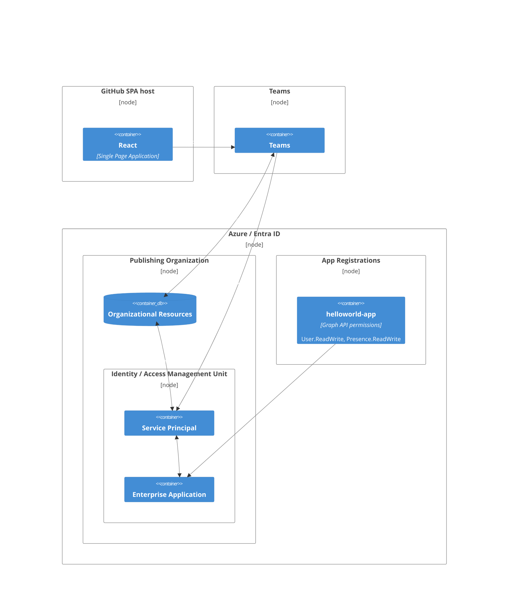

> In this article, we will explore the the vast field of **Microsoft Entra identity platform**, with highlighting key concepts such as **Entra ID**, **Microsoft Authentication library(MSAL)**, **multi-tenant App Registrations**, **Service Principal**, **Graph API**, and exposing the application in organization's **Teams**.
> 
> To understand the complete development process of an application that leverages organizational resources using Entra ID and Graph API, and ultimately gets published on the organization's Teams, I've created a simple project with minimum implementation. The application's features include displaying the logged-in user's profile picture and presence, fetched by Graph API, after signing in with a Microsoft account email.
>
> The application is registered on the Microsoft identity platform to be exposed as an Enterprise Application to my own tenant, and with that, the application will be published in my organization's Teams.
>
> To keep the cost of implementation and deployment at lowest, the application is deployed on GitHub Pages as Single Page Application, and yes, it's a static web application, so naturally its features are limited. But it serves to demonstrate the development process of an application that sits on Microsoft identity platform, so let's get started.

## 0. A Warm Welcome 

Codes of the application are at: [GitHub Repository](https://github.com/CynicDog/azure-entra-in-spa)

The diagram above illustrates the process of registering an application on the Microsoft identity platform, configuring it for exposure to the publishing organization, and ultimately publishing the app within the Teams client.

**Registering your application** on Entra ID establishes its identity configuration, allowing it to integrate with the Microsoft identity platform. This registration means your app trusts the Microsoft identity platform to handle identity and access management tasks. 

Following registration, an **application object** is created. It serves as a global identity configuration template, functioning as a tenant-wide, or even as a cross-tenant interface. Again, it's an one-and-only global configuration template for the registered application, not a run-time instance of the application. 

So, for an organization that wants to utilize identity resources within an application (whether it's an SPA or a server-endorsed application), it needs a local representation of the registered application, ultimately to be configured with rich features of identity platform. That's exactly what a **service principal** is for: a local representation of the registration. The tenant where the app is registered has a service principal for the application, and any other tenants that grant access to the registered app will have their own service principals. 

To sum up, an application registration has:
- A one-to-one relationship with the software application (in our case, a React SPA application that uses MSAL) 
- A one-to-many relationship with its corresponding service principal object(s) for tenants. 
