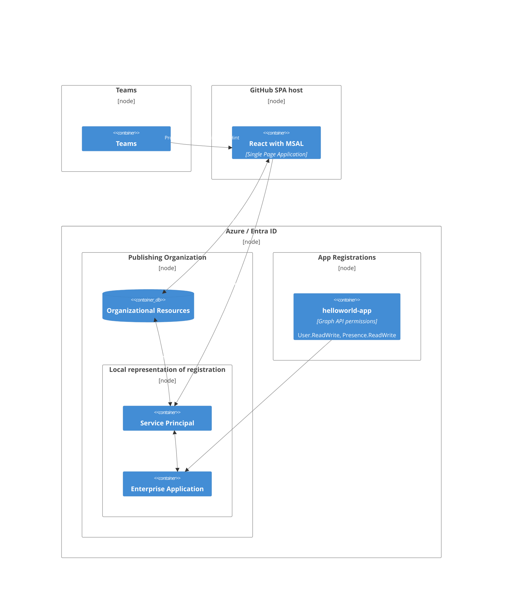

> In this article, we will explore the the vast field of **Microsoft Entra identity platform**, with highlighting key concepts such as **Entra ID**, **Microsoft Authentication library(MSAL)**, **multi-tenant App Registrations**, **Service Principal**, **Graph API**, and exposing the application in organization's **Teams**.
> 
> To understand the complete development process of an application that leverages organizational resources using Entra ID and Graph API, and ultimately gets published on the organization's Teams, I've created a simple project with minimum implementation. The application's features include displaying the logged-in user's profile picture and presence, fetched by Graph API, after signing in with a Microsoft account email.
>
> The application is registered on the Microsoft identity platform to be exposed as an Enterprise Application to my own tenant, and with that, the application will be published in my organization's Teams.
>
> To keep the cost of implementation and deployment at lowest, the application is deployed on GitHub Pages as Single Page Application, and yes, it's a static web application, so naturally its features are limited. But it serves to demonstrate the development process of an application that sits on Microsoft identity platform, so let's get started.

## 0. Deployment Architecture 

Codes of the application are at: [GitHub Repository](https://github.com/CynicDog/azure-entra-in-spa)



The diagram above illustrates the process of registering an application on the Microsoft identity platform, configuring it for exposure to the publishing organization, and ultimately publishing the app within the Teams client.

**Registering your application** on Entra ID establishes its identity configuration, allowing it to integrate with the Microsoft identity platform. This registration means your app trusts the Microsoft identity platform to handle identity and access management tasks. 

Following registration, an **application object** is created. It serves as a global identity configuration template, functioning as a tenant-wide, or even as a cross-tenant interface. Again, it's an one-and-only global configuration template for the registered application, not a run-time instance of the application. 

So, for an organization that wants to utilize identity resources within an application (whether it's an SPA or a server-endorsed application), it needs a local representation of the registered application, ultimately to be configured with rich features of identity platform. That's exactly what a **service principal** is for. The tenant where the app is registered has a service principal for the application, and any other tenants that grant access to the registered app will have their own service principals. 

To sum up, an application registration has:
- A one-to-one relationship with the software application (in our case, a vite-React SPA application that uses MSAL) 
- A one-to-many relationship with its corresponding service principal object(s) for tenants. 

Now that we have set up the configuration for accessing our organizational resources, it's time for MSAL in our React application to perform the authentication flow. Since it's a hosted web application, a user can directly navigate to the entry [endpoint](https://cynicdog.github.io/azure-entra-in-spa/) and sign in. With the access token retrieved via MSAL, the application will then fetch the user's profile and presence status. 

A web application on a browser is fine, but we can take it a step further by integrating it directly into the organizational workplace on Teams. Since a Teams tab application is essentially a wrapper around an embedded web display, we need to make a slight modification to the authentication interaction. The Teams client blocks the login popup and does not allow for authentication redirection within the tab, so we're going to authenticate users with SSO.  

That was a bit of an explanation! With many abstract concepts and vague names in the context, it all sounds quite hazy. So let's see things from a coder's perspective, get our hands dirty, and translate these cloudy concepts of the Microsoft identity platform into our application code.   

## 1. Head-first: MSAL in React. 

Microsoft Authentication library (MSAL) is a set of well abstracted APIs, with support for multiple languages and platforms. Single Page Application in React is one of the supported platforms.   

The first [configuration](https://github.com/CynicDog/azure-entra-in-spa/blob/main/src/main.jsx) to come up with after installing the `@azure/msal-react` package, is to create the instance of MSAL client in React application context. 

```jsx
const config = {
    auth: {
        clientId: "your-client-id-of-app-registrations",  
    },
};

const publicClientApplication = new PublicClientApplication(config);

ReactDOM.createRoot(document.getElementById('root')).render(
    <MsalProvider instance={publicClientApplication}>
        <App />
    </MsalProvider>
);
```

With the authentication client properly configured and integrated into the React project's context, you are ready to use MSAL APIs for tasks such as triggering the login process, acquiring access tokens, and fetching user account information as [follows](https://github.com/CynicDog/azure-entra-in-spa/blob/main/src/components/UserProfile.jsx): 

```jsx
const UserProfile = () => {
    const { instance, inProgress, accounts } = useMsal();
    // ...

    useEffect(() => {
        const accessTokenRequest = {
            scopes: ["User.Read", "User.ReadWrite", "Presence.Read", "Presence.Read.All"],
            account: accounts[0],
        };

        instance
            .acquireTokenSilent(accessTokenRequest)
            .then((accessTokenResponse) => {
                const accessToken = accessTokenResponse.accessToken;

            // make remote call with the access token ... 
    }
}
```
The `useMsal` hook provides access to the MSAL instance, the progress state of authentication processes (`inProgress`), and the user accounts (`accounts`) that MSAL knows about. 

The list of scopes specifies the API permissions that the Graph API will acts on. These permissions outline the specific data and functionalities that the application can access on behalf of the user, and the user will need to provide consent for these permissions during the authentication process.

The remote call to Graph API to fetch user information is done by REST API with access token we just retrieved by MSAL. For example, a logged-in user's profile photo of Microsoft account can be fetched as below:  
```jsx
fetch("https://graph.microsoft.com/v1.0/me/photo/$value", {
    headers: {
        Authorization: `Bearer ${accessToken}`
    }
})
```

Another useful feature of the MSAL library is the `AuthenticatedTemplate` and `UnauthenticatedTemplate` components, which make conditional rendering based on authentication status extremely straightforward. For example, to render a sign-in button only when the user is unauthenticated, you would place it inside the `UnauthenticatedTemplate` component:
```jsx
<UnauthenticatedTemplate>
    <button className="btn btn-outline-primary btn-sm" onClick={handleSignIn}>Sign In</button>
</UnauthenticatedTemplate>
```

Considering the application will be published on the organization’s Teams, it's important to note that the Teams client doesn't allow authentication redirection within tabs or the use of login popups. To address this limitation, I’ve opted for Single Sign-On (SSO) to handle the authentication process in a separate [component](https://github.com/CynicDog/azure-entra-in-spa/blob/main/src/components/UserProfileOnTeams.jsx) with a mapped routing path. 

The separate endpoint will be provided to Teams as a single tab entry, with user's login hint (an email address) passed in as query parameter, in the format of following example. It's also the exact tab URL that we register on [Developer Portal](https://dev.teams.microsoft.com/home) for the application.

```bash   
https://cynicdog.github.io/azure-entra-in-spa/#/teams?name={loginHint}
``` 

When a user accesses the application in Teams, the Teams client references the URL above. The React [router](https://github.com/CynicDog/azure-entra-in-spa/blob/main/src/App.jsx) captures this URL, extracts the login hint, and initiates the SSO process as below: 
```jsx
const UserProfileOnTeams = () => {
    const { instance } = useMsal();

    useEffect(() => {
        const hash = window.location.hash;
        if (hash) {
            const urlParams = new URLSearchParams(hash.split('?')[1]);
            const nameParam = urlParams.get("name");
        }

        let loginHint = "";
        if (nameParam) {
            loginHint = nameParam; // This is the full email
        }

        // MSAL performs authentication with the parsed loginHint ...
```

When using SSO, the MSAL requires an application to explicitly initialize the MSAL instance before calling any APIs, so we need to implement such logic in our [main entry file](https://github.com/CynicDog/azure-entra-in-spa/blob/main/src/main.jsx) as below: 

```jsx
// create PublicClientApplication instance
const publicClientApplication = new PublicClientApplication(config);

const initializeMSAL = async () => {
    await publicClientApplication.initialize();            // let's explicitly initialize the MSAL client here!  

    ReactDOM.createRoot(document.getElementById('root')).render(
        <MsalProvider instance={publicClientApplication}>
            <App />
        </MsalProvider>
    );
};
```

These are the key points of using MSAL with React in a Single Page Application. Now, let’s deploy and host the application!

## 2. A Rare Giving Spirit: GitHub Actions and GitHub Pages. 

There is a perfect fit for hosting our static SPA project: GitHub Pages, a static site hosting service provided by GitHub. The goal is to deploy our Vite-React project on GitHub Pages using GitHub Actions. GitHub Actions enables the automation of CI/CD pipelines, allowing for efficient build, test, and deployment processes. Another key reason of using GitHub Actions is to securely provide credentials, such as the application identifier (client id) generated during the application registration on Azure Entra ID, as runtime environment variables within the GitHub Actions workflow commands.  

But let's start with local deployment and set aside GitHub Actions for now.  

The Node package [gh-pages](https://www.npmjs.com/package/gh-pages) is a great tool that simplifies the process of publishing static files to GitHub Pages, so let's set up the publishing environment for vite-React project locally.  

When deployed on GitHub Pages, the base URL of for the web application is set to `http(s)://<username>.github.io/<repository>` by default, so we need to specify the base URL in our [vite configuration](https://github.com/CynicDog/azure-entra-in-spa/blob/main/vite.config.js) accordingly, using `/{PROJECT_REPOSITORY}/#` as the value for the base URL attribute. 

Notice that I suffixed the hash sign on the base URL.

Routing in Single Page Application can be a bit tricky, especially when deploying on static site hosts like GitHub Pages which is built for static sites, where every HTML, CSS, JS, image, etc., file is expected to be an actual file. On receiving the request of `cynicdog.github.io/azure-entra-in-spa/teams?name={loginHint}`, GitHub Pages will look for an `index.html` file in a directory called `./teams` which doesn't exist. 

To overcome this issue, we're going to integrate `HashRouter` from `react-router-dom` as [below](https://github.com/CynicDog/azure-entra-in-spa/blob/main/src/App.jsx):

```jsx
import { HashRouter as Router, Route, Routes } from 'react-router-dom';
const App = () => {

  return (
      <Router>
          <Routes>
              <Route path="/" element={<EntryPoint />} />
              <Route path="/export" element={<ExportView />} />
              <Route path="/teams" element={<UserProfileOnTeams />} />
          </Routes>
      </Router>
  )
}
export default App
```

`HashRouter` makes it possible to store the current location in the hash portion of the current URL, so it is never sent to the server. For example, when handling a URL entry of `cynicdog.github.io/azure-entra-in-spa/#/teams?name={loginHint}`, everything after the hash is processed by React, ultimately rendering `UserProfileOnTeams` [component](https://github.com/CynicDog/azure-entra-in-spa/blob/main/src/components/UserProfileOnTeams.jsx). 

Then we set a full URL of our application home page deployed on GitHub Pages in [package.json](https://github.com/CynicDog/azure-entra-in-spa/blob/main/package.json) file and also add scripts to run `gh-pages` commands as below:

```jsonc
{
  // ... 
  "homepage": "https://cynicdog.github.io/azure-entra-in-spa/#",
  // ...
  "scripts": {
    // ...
    "predeploy": "npm run build",
    "deploy": "gh-pages -d dist"
    // ...
  }
  // ... 
}
```

Now we can run the deploy scripts, `npm install predeploy; npm run deploy` and `gh-pages` will perform the deployment process, however, I suggest not to run this command at the moment. Since the credentials are hardcoded in the code lines, they are going to be included in distribution files, and ultimately get exposed to public when published on web. 

Curbing the enthusiasm, what we are going to do as a final step in deployment is to securely provide such credentials. 

Executing CLI commands with securely provided secrets to deploy an application. Now that sounds like the perfect use case for GitHub Actions!

So I wrote a GitHub Action [workflow](https://github.com/CynicDog/azure-entra-in-spa/blob/main/.github/workflows/build-and-deploy.yml) that checks out the repository, install dependencies, then run the `npm run deploy` command as the final step, with providing credentials and configuration values as runtime environment variables. Secrets are stored as repository secrets, and `GITHUB_TOKEN` is given read-and-write permission.   

First thing to point out in the workflow file is that we prefix all the environment variables with `VITE_`, since only variables prefixed with `VITE_` are exposed to vite-processed codes: 

 
```yml
 env:
      VITE_AZURE_CLIENT_ID: ${{ secrets.AZURE_CLIENT_ID }}
```


These variables will then retrieved in the code like below:
```jsx
const config = {
    auth: {
        clientId: import.meta.env.VITE_AZURE_CLIENT_ID,
    },
};
```

Another thing to address in the workflow is to specify user identity and authentication details on Git context inside the workflow: 

 
```yml
- name: Configure git to use HTTPS and set credentials
  run: |
    git config user.name "${{ github.actor }}"
    git config user.email "${{ github.actor_id }}+${{ github.actor }}@users.noreply.github.com"
    git remote set-url origin https://x-access-token:${{ secrets.GITHUB_TOKEN }}@github.com/${{ github.repository }}.git
```


This command set the remote repository URL to include an access token, allowing the workflow to authenticate when pushing changes. 

We can run the workflow manually on repository Actions tab. Upon completion, you will see a workflow run named `pages-build-deployment` will follow up the workflow we triggered. That's a called workflow by `gh-pages` command, and once it completes successfully, you will see the application deployed on GitHub Pages. Below is the embedded view of deployed application: 

<iframe width="100%" height="300" src="https://cynicdog.github.io/azure-entra-in-spa/" style="border-radius: 10px;"></iframe>

That’s a well-functioning web application, and now we’re set to integrate it into the Teams client. One important takeaway is that the Teams client blocks the login popup initiated by MSAL, as well as any authentication redirection within the tab. To address this limitation, I came up with Single-Sign-On for the authentication. Ultimately, using SSO for authentication within Teams makes much more sense, as users are already signed in to the client. 

There are two handshake points between systems in the scenario of publishing an app on Teams. The first handshake occurs between the published application on Teams and the hosted React web application, where the user's login information from the Teams client is passed to the React app as a URL query parameter (i.e. `?name={loginHint}`), as we’ve seen earlier.

The second handshake takes place between the published application on Teams and the application object on Entra ID. The bridge here is the **Application ID URI**, which serves as a globally unique identifier for the web API exposed by our application object to access through scopes. We need to link the Application ID URI with the Teams application, so that a trust between them can be established, which is essential for ensuring SSO authentication flow. 

One important note is that when you define an Application ID URI in App Registrations on the Azure Portal, you need to register a client identifier `5e3ce6c0-2b1f-4285-8d4b-75ee78787346`, which is a unique value for Teams web client (see the full list of client IDs [here](https://learn.microsoft.com/en-us/microsoftteams/platform/tabs/how-to/authentication/tab-sso-register-aad#to-configure-authorized-client-application)). Additionally, the format of the Application ID URI should be `api://{fully-qualified-domain-name.com}/{your-client-id-of-app-registrations}`, where the domain is, in our case, `{github-username}.github.io/{repository-name}`. 

## 3. Can the Service Principal Speak? 

Roles and types of service principal,
relationship between Service Principal and App Registrations, 
Graph API permission types (delegated / application) 

## 4. Closing. 
