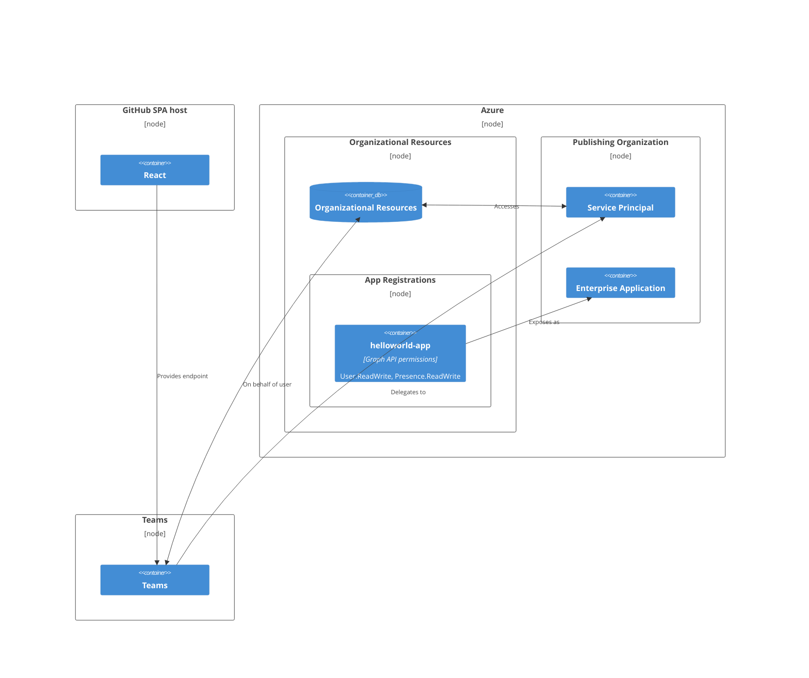

> In this article, we will explore the the vast field of **Microsoft Entra identity platform**, with highlighting key concepts such as **Entra ID**, **Microsoft Authentication library(MSAL)**, **multi-tenant App Registrations**, **Service Principal**, **Graph API**, and exposing the application in organization's **Teams**.
> 
> To understand the complete development process of an application that leverages organizational resources using Entra ID and Graph API, and ultimately gets published on the organization's Teams, I've created a simple [project](https://github.com/CynicDog/azure-entra-in-spa) with minimum implementation. The application's features include displaying the logged-in user's profile picture and presence, fetched by Graph API, after signing in with a Microsoft account email.
>
> The application is registered on the Microsoft identity platform to be exposed as an Enterprise Application to my own tenant, and with that, the application will be published in my organization's Teams.
>
> To keep the cost of implementation and deployment at lowest, the application is deployed on GitHub Pages as Single Page Application, and yes, it's a static web application, so naturally its features are limited. But it serves to demonstrate the development process of an application that sits on Microsoft identity platform, so let's get started.

## 0. A Warm Welcome 

