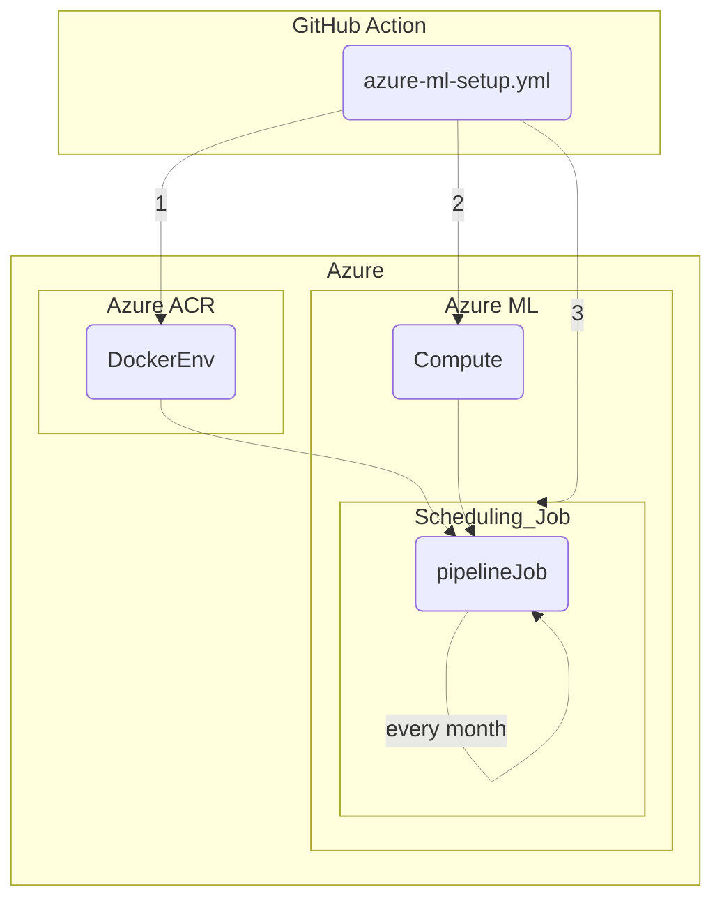

> In this article, I will walk through the details of an Azure Machine Learning pipeline that automates the entire process of deploying an AutoML model in Azure. The challenges were to set up the compute environment of each task in the pipeline within a properly authenticated environment, while also ensuring that all necessary dependencies and configurations were correctly implemented within a containerized Linux environment. 
> 
> The Linux container, containing configuration files for Azure CLI commands and the dataset for AutoML training, is built and pushed to Azure Container Registry using a GitHub Action runner. Additionally, the Azure ML compute environment and scheduling specifications are also set up by the GitHub Action runner. The pipeline tasks are then executed on the Azure ML compute environment, following the behavior defined in the pipeline script.
>
> The requirement was to use only the Azure Machine Learning CLI instead of the Python SDK, which introduced many pathing challenges that needed to be solved entirely through Bash scripting in a Linux environment. Such challenges helped me gain a deeper understanding of how to implement logics in a containerized setup and come up with the necessary configurations.

## 0. Project Architecture 

- Codes of the application are at: [GitHub Repository](https://github.com/CynicDog/Azure-ML-automation-research)
- GitHub Action script: [azure-ml-setup.yml](https://github.com/CynicDog/Azure-ML-automation-research/blob/main/.github/workflows/azure-ml-setup.yml)
- Azure ML Pipeline script: [scheduled_pipeline_job.yml](https://github.com/CynicDog/Azure-ML-automation-research/blob/main/scripts/scheduled_pipeline_job.yml)

More of the article is coming up ...
