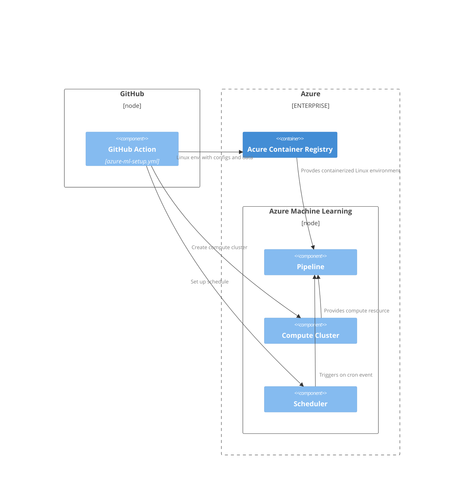

> In this article, I will walk through the details of an Azure Machine Learning pipeline that automates the entire process of deploying an AutoML model in Azure. The challenges were to set up the compute environment of each task of the pipeline within a properly authenticated environment, while also ensuring that all necessary dependencies and configurations were correctly implemented within a containerized Linux environment. 
> 
> The Linux container, containing configuration files for Azure CLI commands and the dataset for AutoML training, is built and pushed to Azure Container Registry using a GitHub Action runner. Additionally, the Azure ML compute environment and scheduling specifications are also set up by the GitHub Action runner. The pipeline tasks are then executed on the Azure ML compute environment, following the behavior defined in its script.
>
> The requirement to use only the Azure Machine Learning CLI instead of the Python SDK introduced several pathing challenges that had to be addressed entirely through Bash scripting in a Linux environment. Overcoming these obstacles provided notable insights, so let's get started with going through details of the project!

## 0. Project Architecture 

- GitHub Action script: [azure-ml-setup.yml](https://github.com/CynicDog/Azure-ML-automation-research/blob/main/.github/workflows/azure-ml-setup.yml)
- Azure ML Pipeline script: [scheduled_pipeline_job.yml](https://github.com/CynicDog/Azure-ML-automation-research/blob/main/scripts/scheduled_pipeline_job.yml)

More of the article is coming up ...
