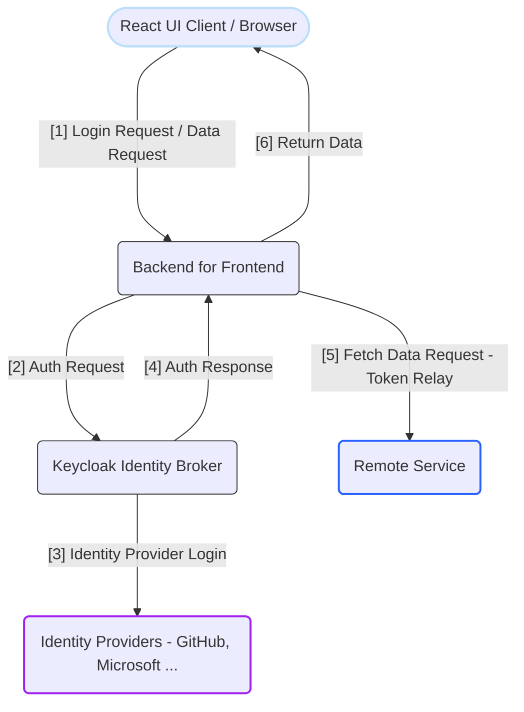

> In this article, we are going to explore the implementation of identity providers' OAuth2 flow in a cloud-native Spring development.
>
> In a cloud-native development environment, there’s a lot to consider, from secure resource/configs management to precise integration of various services. Tools with a strong cloud affinity like Jib and GitHub Actions simplifiy the development process much smoother, helping you easily manage containerization and automate deployments. Keycloak also stands out with its great portability and compatibility, ensuring fluent integration of authentication services into applications regardless of the infrastructure used.
>
> Although there are numerous competent solutions to requirements of cloud-native development nowadays, Spring remains a vital framework even in this landscape.
>
> This project involves a **React UI**, a **Spring-based Backend for Frontend (BFF)**, and **Keycloak** as an identity broker integrated with **GitHub** as the identity provider (IdP). The goal is to log in via GitHub through Keycloak and display simple text data from a **remote service** on the React UI. The focus is on implementing OAuth2 authentication using Keycloak and understanding identity brokering.
> 
> By walking through the details, we will explore Spring's ready-to-use integrations and address some security and networking challenges encountered on the journey of deploying the application in a local Kubernetes context. So let's get started! 

## 0. Project Overview 
Codes of the application are at: [GitHub Repository](https://github.com/CynicDog/spa-spring-keycloak-oauth2)



## 1. Backend for Frontend: a Spring Cloud Gateway Project 
The Backend for Frontend (BFF) pattern serves as an essential edge service that interacts with Single Page Applications (SPAs) while handling security concerns. As a gateway, the BFF acts as an intermediary between the SPA and various backend services. It efficiently routes requests from the SPA to the appropriate services. Spring Cloud Gateway is an ideal choice for implementing a BFF in this scenario, since it provides a lightweight, scalable, and highly customizable API gateway solution, perfectly suited to act as the edge service for SPAs. 

When it comes to security management, the BFF is capable of performing a central role in authentication. It can integrate with identity providers, such as Keycloak, to manage user sessions and validate tokens. The gateway service, with the Spring Security dependency included, will securely manage the interaction between users and the project's features.

Let's start a project with dependencies in place: 
```gradle
dependencies { 
    implementation 'org.springframework.boot:spring-boot-starter-oauth2-client'
    implementation 'org.springframework.boot:spring-boot-starter-security'
    implementation 'org.springframework.cloud:spring-cloud-starter-gateway'
}
```
> See [build.gradle](https://github.com/CynicDog/spa-spring-keycloak-oauth2/blob/main/backend-for-frontend/build.gradle) for for the complete list of dependencies and project configuration details

Since the BFF acts as a gateway for both the React UI and the remote server (referred to as the resource server in the security context), we can configure the security settings accordingly.

```yaml
spring:
  cloud:
    gateway:
      routes:
        - id: react-ui-route
          uri: ${REACT_UI_URL:http://localhost:8880}
          predicates:
            - Path=/,/*.css,/*.js,/favicon.ico,/assets/**,/*.svg
        - id: authenticated-service-route
          uri: ${REMOTE_SERVICE_URL:http://localhost:9001}/remote-service
          predicates:
            - Path=/remote-service/**
      default-filters:
        - TokenRelay
```
> Any request that ends with /, /*.css, /*.js, /favicon.ico, /assets/**, /*.svg URI will be routed to the React UI service by the injected URI, and the other will be routed to the remote service at the specified URI, ensuring that any requests matching the path /remote-service/** are directed to the appropriate backend resource. See [application.yml](https://github.com/CynicDog/spa-spring-keycloak-oauth2/blob/main/backend-for-frontend/src/main/resources/application.yml) for for the complete configuration.

You may have noticed the default `TokenRelay` filter configuration applied to every request coming into the BFF service. A Token Relay occurs when an OAuth2 consumer, in our case the BFF service, acts as a client and forwards the incoming token with outgoing resource requests, such as those to the React UI and remote service.


## 2. SPA, OAuth2 Client, Resource Server: Spring Security  

Now that we have configured the routing conditions on requests, let's apply authentication logics on incoming request to the BFF service. 

```java
@Configuration
@EnableWebFluxSecurity
public class SecurityConfig {

    @Bean
    SecurityWebFilterChain springSecurityFilterChain(ServerHttpSecurity http) {
        return http
                .authorizeExchange(exchange -> exchange
                        .pathMatchers("/assets/**").permitAll()
                        .pathMatchers("/", "/*.css", "/*.js", "/favicon.ico", "/*.svg").permitAll()
                        .anyExchange().authenticated()
                )
                .exceptionHandling(exceptionHandling -> exceptionHandling
                        .authenticationEntryPoint(new HttpStatusServerEntryPoint(HttpStatus.UNAUTHORIZED)))
                .oauth2Login(Customizer.withDefaults())
                .csrf(csrf -> csrf
                        .csrfTokenRepository(CookieServerCsrfTokenRepository.withHttpOnlyFalse())
                        .csrfTokenRequestHandler(new SpaServerCsrfTokenRequestHandler())
                )
                .build();
    }
    // ...
```
> In Spring Security 6, the annotations `@EnableWebFluxSecurity` and `@EnableReactiveMethodSecurity` no longer include the @Configuration annotation by default. Therefore, whenever you use these annotations in your security configuration, you must explicitly add the `@Configuration` annotation to the class. See [application.yml](https://github.com/CynicDog/spa-spring-keycloak-oauth2/blob/main/backend-for-frontend/src/main/java/io/cynicdog/backendforfrontend/config/SecurityConfig.java) for for the complete configuration.

Here, we configure requests routed to the React UI to be permitted, while all other requests, such as those to the remote service, require authentication, which will be handled by Token Relay.

Another important take-away from this snippet is the CSRF configuration for single-page applications (SPAs) that enables secure interactions with the server while maintaining usability: 
  - `withHttpOnlyFalse` allows the browser to access cookies using JavaScript code.
  - `SpaServerCsrfTokenRequestHandler` allows JavaScript applications to access not just the plain token values, but also encoded ones. requiring a custom request handler, which is why we configured.

