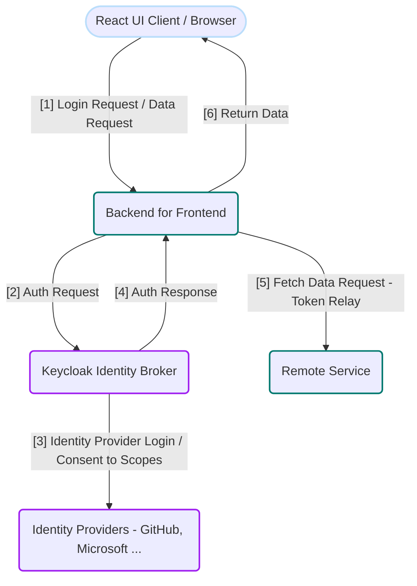

> In this article, we are going to explore the implementation of identity providers' OAuth2 flow in a cloud-native Spring development. Although there are numerous competent solutions to requirements of cloud-native development nowadays, Spring remains a vital framework even in this landscape.
>
> In a cloud-native development environment, there’s a lot to consider from secure resource/configs management to precise integration of various services. Keycloak stands out with its great portability and compatibility, ensuring fluent integration of authentication services into applications regardless of the infrastructure used. Tools with a strong cloud affinity like Jib and GitHub Actions also simplifiy the development process much smoother, helping you easily manage containerization and automate deployments. 
>
> This project involves a **React UI**, a **Spring-based Backend for Frontend (BFF)**, and **Keycloak** as an identity broker integrated with **GitHub** as the identity provider (IdP). The goal is to social-log in via GitHub through Keycloak and display simple text data from a **remote service** on the React UI. The focus is on implementing OAuth2 authentication using Keycloak as identity broker.
> 
> By walking through the details, we will explore Spring's ready-to-use integrations and address some security and networking challenges encountered on the journey of deploying the application in a local Kubernetes context. So let's get started! 

## 0. Project Overview 
Codes of the application are at: [GitHub Repository](https://github.com/CynicDog/spa-spring-keycloak-oauth2)



## 1. Backend for Frontend: a Spring Cloud Gateway Project 
As a gateway, the BFF acts as an intermediary between the SPA and various backend services. It efficiently routes requests from the SPA to the appropriate services. Spring Cloud Gateway is an ideal choice for implementing a BFF in this scenario, since it provides a lightweight, scalable, and highly customizable API gateway solution. 

When it comes to security management, BFF plays a central role in authentication. It can integrate with identity providers, such as Keycloak, to manage user sessions and validate tokens. The gateway service, equipped with the Spring Security dependency, will securely handle user interactions with the project's features. I'll use 'gateway' and 'backend-for-frontend' interchangeably to refer to the project.

Let's start a project with dependencies in place: 
```gradle
dependencies { 
    implementation 'org.springframework.boot:spring-boot-starter-oauth2-client'
    implementation 'org.springframework.boot:spring-boot-starter-security'
    implementation 'org.springframework.cloud:spring-cloud-starter-gateway'
}
```
> See [build.gradle](https://github.com/CynicDog/spa-spring-keycloak-oauth2/blob/main/backend-for-frontend/build.gradle) for for the complete list of dependencies and project configuration details

Since the BFF acts as a gateway for both the React UI and the remote server (referred to as the resource server in the security context), we can configure the security settings accordingly.

```yaml
spring:
  cloud:
    gateway:
      routes:
        - id: react-ui-route
          uri: ${REACT_UI_URL:http://localhost:8880}
          predicates:
            - Path=/,/*.css,/*.js,/favicon.ico,/assets/**,/*.svg
        - id: authenticated-service-route
          uri: ${REMOTE_SERVICE_URL:http://localhost:9001}/remote-service
          predicates:
            - Path=/remote-service/**
      default-filters:
        - TokenRelay
```
> Any request URI for static files used in React rendering, such as `/`, `/*.css`, `/*.js`, and `/assets/**`, will be routed to the React UI service via the injected URI. The rest will be routed to the remote service at the specified URI, ensuring that any requests matching the path `/remote-service/**` are directed to the appropriate backend resource. See [application.yml](https://github.com/CynicDog/spa-spring-keycloak-oauth2/blob/main/backend-for-frontend/src/main/resources/application.yml) for for the complete configuration.

You may have noticed the default `TokenRelay` filter configuration applied to every request coming into the BFF service. A Token Relay occurs when an OAuth2 consumer, in our case the BFF service, acts as a client and forwards the incoming token with outgoing resource requests, such as those to the React UI and remote service.


## 2. Securing OAuth2 Flows in SPA with Spring Security

### 2.1. Configuring Web Filters on the gateway server 

Now that we have configured the routing conditions on requests, let's apply authentication logics on incoming request to the BFF service. 

```java
@Configuration
@EnableWebFluxSecurity
public class SecurityConfig {

    @Bean
    SecurityWebFilterChain springSecurityFilterChain(ServerHttpSecurity http) {
      return http
          .authorizeExchange(exchange -> exchange
                .pathMatchers("/assets/**")
                    .permitAll()
                .pathMatchers("/", "/*.css", "/*.js", "/favicon.ico", "/*.svg")
                    .permitAll()
                .anyExchange()
                    .authenticated()
          )
          .exceptionHandling(exceptionHandling -> exceptionHandling
                .authenticationEntryPoint(
                    new HttpStatusServerEntryPoint(HttpStatus.UNAUTHORIZED))
          )
          .oauth2Login(Customizer.withDefaults())
          .csrf(csrf -> csrf
                .csrfTokenRepository(
                    CookieServerCsrfTokenRepository.withHttpOnlyFalse())
                .csrfTokenRequestHandler(new SpaServerCsrfTokenRequestHandler())
          )
          .build();
      }
      // ...
```
> In Spring Security 6, the annotations `@EnableWebFluxSecurity` and `@EnableReactiveMethodSecurity` no longer include the `@Configuration` annotation by default. Therefore, whenever you use these annotations in your security configuration, you must explicitly add the `@Configuration` annotation to the class. See [SecurityConfig.java](https://github.com/CynicDog/spa-spring-keycloak-oauth2/blob/main/backend-for-frontend/src/main/java/io/cynicdog/backendforfrontend/config/SecurityConfig.java) for for the complete configuration.

Here, we configure requests routed to the React UI to be permitted, while all other requests, such as those to the remote service, require authentication, which will be handled by Token Relay.

Another important takeaway from this snippet is the CSRF configuration for single-page applications (SPAs) that enables secure interactions with the server while maintaining usability: 
  - `CookieServerCsrfTokenRepository.withHttpOnlyFalse` allows the browser to access cookies using JavaScript code.
  - `SpaServerCsrfTokenRequestHandler` allows JavaScript applications to access not just the plain token values, but also encoded ones. 

There is one more filter configuration, [csrfWebFilter](https://github.com/CynicDog/spa-spring-keycloak-oauth2/blob/9bcc8bbfcce0c77c9c106f42b01601e71cc07b12/backend-for-frontend/src/main/java/io/cynicdog/backendforfrontend/config/SecurityConfig.java#L43), to be registered for handling CSRF tokens since we are using the reactive core of Spring WebFlux for our web server. Reactive repositories won't save the token unless there is a subscription to the result, so we need to subscribe to the token-recognition behavior. 

### 2.2. Keycloak as an Identity Brocker  

The Spring Gateway project needs the Spring Security OAuth2 Client dependency to support OAuth2 functionality for successful startup, which means that the Keycloak identity server must be up and running with a configuration that registers the gateway project as a security client. For the complete configuration, refer to [keycloak-config-docker.sh](https://github.com/CynicDog/spa-spring-keycloak-oauth2/blob/main/manifests/keycloak-config-docker.sh) and [keycloak-config-minikube.sh](https://github.com/CynicDog/spa-spring-keycloak-oauth2/blob/main/manifests/keycloak-config-minikube.sh). Here's one important command in the scripts:   

```bash
/opt/keycloak/bin/kcadm.sh create identity-provider/instances \
  	-r cynicdog \
  	-s alias=github \
  	-s providerId=github \
  	-s enabled=true  \
  	-s 'config.useJwksUrl="true"' \
  	-s config.clientId={GITHUB_APP_CLIENT_ID} \
  	-s config.clientSecret={GITHUB_APP_CLIENT_SECRET}
```
>  Since we are using GitHub as one of the identity providers for our application, we also need to create a GitHub App on GitHub's server to obtain the client ID and client secret necessary for OAuth2 authentication. Follow the instruction [here](https://github.com/CynicDog/spa-spring-keycloak-oauth2?tab=readme-ov-file#create-github-identity-provider-github-apps) for GitHub App registration.  

So we have configured the gateway server and `Keycloak` server, it's time to follow and understand the journey of OAuth2 authentication flow with Keycloak as a identity brocker. 

React is where we write the entrypoint of OAuth2. Here's the very first entry of the authentication flow, where users click a login button on UI: 

```jsx
const LoginButton = () => {
  return (
    <>
      <div style={{margin: "5px"}}>
        <button onClick={() => { window.open('/oauth2/authorization/keycloak', '_self'); }}>
          login
        </button>
      </div>
    </>
  )
}
```
> `window.open('/oauth2/authorization/keycloak', '_self')` opens the URL that initiates the OAuth2 login flow. Since the React project is behind the gateway service, `_self` refers to the gateway's host, where Spring Security handles the `/oauth2/authorization/{REGISTRATION_ID}` endpoint — `keycloak` in our case. Spring Security then delegates to `Keycloak`, redirecting the browser to a login page where users can choose identity providers.

When redirected to a default login page by Keycloak, users will be seeing two login options: a credential-based authentication and social login. If a user opts to login using their credentials, Keycloak acts as the identity provider. 

On the other hand, when a user selects a social login option such as signing in with GitHub, Keycloak serves as an identity broker, where the identity provider is now external identity providers such as GitHub and Azure. The browser will navigate to GitHub's consent page, where the user is prompted to authorize the application to access their data.

Then GitHub’s server sends an authorization code to the redirect URI after the user consents via a request (`https://github.com/login/oauth/authorize?...`). Subsequently, the identity brocker (Keycloak) sends a request to GitHub's token endpoint to exchange the authorization code for an access token, allowing it to fetch user data based on the user’s consent over the access scopes.

> It's important to note that the redirect URIs are defined based on our configuration, whether as hard-coded values in the [application.yml](https://github.com/CynicDog/spa-spring-keycloak-oauth2/blob/2538c8bcbdb6b1ed9ba4ecdeed29efda31a6cf28/backend-for-frontend/src/main/resources/application.yml#L31) , or as passed-in environment variables in [Docker Compose](https://github.com/CynicDog/spa-spring-keycloak-oauth2/blob/2538c8bcbdb6b1ed9ba4ecdeed29efda31a6cf28/manifests/docker-compose.yml#L16), or as in the Kubernetes [manifest](https://github.com/CynicDog/spa-spring-keycloak-oauth2/blob/2538c8bcbdb6b1ed9ba4ecdeed29efda31a6cf28/manifests/backend-for-frontend.yml#L27). 
{: .prompt-info }

Keycloak also involves browser redirections, exposing request URIs such as `http://host.docker.internal` in a Docker Compose context and `http://keycloak` when deployed in Minikube. The browser lacks literacy for these URIs without the help of local DNS resolution, so let's fix that. 

The first configuration for Docker hostname resolution has already been done when installing Docker on local machine, so we are good to go. To enable the browser to resolve these URIs when applications are deployed in Minikube, however, we need to add entries for the local IP address and service name to the DNS hosts file. Run the following command depending on the operating system that applications are running on: 

- On Linux/MacOS: 
  ```bash
  echo "127.0.0.1 keycloak" | sudo tee -a /etc/hosts
  ```
- On Window (As administrator):
  ```powershell
  Add-Content C:\Windows\System32\drivers\etc\hosts "127.0.0.1 keycloak"
  ```

Since Keycloak has internally implemented the handling for such requests by identity providers, we are all set to proceed to the entry point of our application. 

After the successful authentication the browser will navigate to the base URL. We need to come up with a script that checks the authentication status from the gateway server. 


```jsx
export const AuthProvider = ({ children }) => {

    const [isAuthenticated, setIsAuthenticated] = useState(false);

    useEffect(() => {
        const authenticate = async () => {
            try {
                const userData = await getUser();
                if (userData) {
                    setIsAuthenticated(true);
                } else {
                    setIsAuthenticated(false);
                }
            }
        };
        authenticate();
    }, []);

    return (
        <AuthContext.Provider value={{ isAuthenticated, user }}>
            {children}
        </AuthContext.Provider>
    );
};
```


With this context set up, we can differentiate the renders based on authentication status in our UI. When the browser serves an authenticated user, it will make a request to the remote server, which we will discuss in the next section.

## 3. Token Relay and CSRF

For authenticated users, the React UI makes a remote call to the `backend-for-frontend` server at the URI `/remote-service/check`.

As both a security client and a gateway server, the `backend-for-frontend` server then parses the URI to identify the request's destination and determines the appropriate security behavior. This includes deciding whether to relay the authenticated user's credentials (JWT token) based on the security configuration for that destination. Here's our configuration: 

```yaml
spring:
  cloud:
    gateway:
      routes:
        - id: remote-service-route
          uri: ${REMOTE_SERVICE_URL:http://localhost:9001}/remote-service
          predicates:
            - Path=/remote-service/**
      default-filters:
        - TokenRelay
```
> Since we have configured the server to require authentication for any requests other than those for React UI rendering resources, it will forward the remote call request to the `remote-service` with the necessary authentication requirements. 

One important takeaway is that CSRF protection on the gateway is essential for token relay to function correctly, as it helps securely maintain sessions for the authorization code flow to succeed. This is why we have configured two settings for CSRF protection in the beginning of the project. 

The response from the `remote-service` is a simple text. With everything in place, React will finally render the successful response message on the browser for authenticated users. 

## 4. Containerize Spring in a Cloud Native Way: Jib, Gradle and GitHub Action  

Jib is a powerful tool that simplifies the process of building Docker images for Java applications without requiring a Docker daemon. Jib makes building Docker images easier by integrating directly with your Maven or Gradle build process. You don’t need to write a Dockerfile, run a Docker daemon, or bundle everything into a single JAR file. Since Jib works closely with your Java build, it automatically packages your application with all the necessary components. 

We can write the Jib build script in the `build.gradle` file using Groovy as the scripting language. This script configures the build settings, including the base image, target platforms, image registry location, credentials, and environment variables. Here's the configuration for the `backend-for-frontend` service in our project:

```gradle
jib {
    from {
        image = 'eclipse-temurin:20'
        platforms {
            platform {
                os = "linux"
                architecture = "arm64"
            }
            platform {
                os = "linux"
                architecture = "amd64"
            }
        }
    }
    to {
        image = "ghcr.io/${System.getenv('GITHUB_REPOSITORY')?.toLowerCase() ?: 'default_repo'}/backend-for-frontend-service:latest"
        auth {
            username = "${System.getenv('GITHUB_ACTOR')?.toLowerCase() ?: 'default_actor'}"
            password = "${System.getenv('GITHUB_TOKEN') ?: 'default_token'}"
        }
    }
    container {
        environment = [
                'REACT_UI_URL': System.getenv('REACT_UI_URL') ?: 'http://localhost:5174',
                'REMOTE_SERVICE_URL': System.getenv('REMOTE_SERVICE_URL') ?: 'http://localhost:9001',
                'SPRING_SECURITY_OAUTH2_CLIENT_PROVIDER_KEYCLOAK_ISSUER_URI': System.getenv('SPRING_SECURITY_OAUTH2_CLIENT_PROVIDER_KEYCLOAK_ISSUER_URI') ?: 'http://localhost:8080/realms/cynicdog'
        ]
    }
}
```
> The configuration uses the `eclipse-temurin:20` as base image and supports both `linux/arm64` and `linux/amd64` platforms (Multi-platform build). It sets environment variables for the container, using values from the system or falling back to defaults if they’re not provided. See [build.gradle](https://github.com/CynicDog/spa-spring-keycloak-oauth2/blob/main/backend-for-frontend/build.gradle) for for the complete configuration.

With the build script in place, the next step is to trigger the build behavior. We'll use GitHub Actions as our continuous integration platform. The process is straightforward, as the build scripts are already defined in `build.gradle`. The workflow simply checks out the repository and runs the Gradle build command using the included Gradle wrapper. Here's some of the notable steps of the workflow: 

```yaml
      # Grant execute permission for Gradle wrapper
      - name: Grant execute permission for Gradle wrapper
        run: chmod +x backend-for-frontend/gradlew

      # Set up JDK 20
      - name: Set up JDK 20
        uses: actions/setup-java@v4.2.2
        with:
          distribution: 'temurin'
          java-version: '20'

      # Build and push Docker image using Jib
      - name: Build and push Docker image
        env:
          GITHUB_REPOSITORY: ${{ github.repository }}
          GITHUB_ACTOR: ${{ github.actor }}
          GITHUB_TOKEN: ${{ secrets.GHCR_PAT_TWO }}
        run: cd backend-for-frontend && ./gradlew jib
```
> Make sure that the JDK set for workflow matches the one for development and Jib base image to avoid potential issues related to differences in Java versions. Since a new image will be pushed to GitHub Container Registry, we need a Personal Access Token with the `write:packages` scope, which should be registered as a repository secret. The workflow then securely retrieves this token and passes it to the Gradle build context as credentials. See [backend-for-frontend-build.yaml](https://github.com/CynicDog/spa-spring-keycloak-oauth2/blob/main/.github/workflows/backend-for-frontend-build.yml) for for the complete configuration. 

## 5. Final Step: Deploy on Minikube

With each service image in place, all that's left to deploy the project are the Kubernetes resource manifests. The manifest files in the project's [manifest](https://github.com/CynicDog/spa-spring-keycloak-oauth2/tree/main/manifests) directory are standard and straightforward, with no special configurations. Since we'll deploy the applications on Minikube using two Ingresses with the Minikube Nginx Ingress Controller — one for the `backend-for-frontend` project and another for the `Keycloak` host — we need to define the access rules for our services within the cluster using [ingress-bff.yml](https://github.com/CynicDog/spa-spring-keycloak-oauth2/blob/main/manifests/ingress-bff.yml) and [ingress-keycloak.yml](https://github.com/CynicDog/spa-spring-keycloak-oauth2/blob/main/manifests/ingress-keycloak.yml). Let's start with starting Minikube: 

```bash
minikube start --cpus 2 --memory 2g 
```
> This command provisions the compute resources for your Minikube cluster, allocating 2 CPUs and 2 GB of memory. Since our project doesn't require heavy computational resources, this will be sufficient.

To enable the NGINX Ingress controller, run the following command:

```bash
minikube addons enable ingress
```
> Network connectivity is limited when using the Docker driver on macOS (Darwin), preventing direct access to the Node IP. To get ingress to work you’ll need to open a new terminal and run `minikube tunnel`, then you can access to the cluster via `127.0.0.1`.

After enabling the NGINX Ingress controller, we can proceed to define the access rules for our services. The `ingress-bff.yml` and `ingress-keycloak.yml` files will set up routing for the `backend-for-frontend` project and `Keycloak`, respectively. Let's look into the configuration for `Keycloak` first: 

```yaml
apiVersion: networking.k8s.io/v1
kind: Ingress
metadata:
  name: keycloak-ingress
  labels:
    app: keycloak
spec:
  rules:
    - host: keycloak
      http:
        paths:
          - path: /
            pathType: Prefix
            backend:
              service:
                name: keycloak
                port:
                  number: 80
```
> Keycloak performs a browser redirect using a URI that exposes the service name as the host. Since Minikube is tunneled through `127.0.0.1` and the deployed `Keycloak` service name matches the one configured in the hosts file, the browser redirects will resolve correctly.

The other ingress rules instruction for `backend-for-frontend` service looks as below: 

```yaml
apiVersion: networking.k8s.io/v1
kind: Ingress
metadata:
  name: bff-ingress
spec:
  rules:
    - http:
        paths:
          - path: /
            pathType: Prefix
            backend:
              service:
                name: backend-for-frontend
                port:
                  number: 80
```
> Note that since this Ingress resource is for the `backend-for-frontend` server, there's no specific path configuration for API endpoints; it simply routes all traffic from the root path (`/`) to the `backend-for-frontend` service on port 80. This setup enables the Ingress controller to route incoming requests to the gateway server, which then handles further routing.

We can now deploy applications by applying the manifest files by runnning the following command:

```bash
kubectl apply -f ./manifests 
```

That's it! With the services up and running, you should be able to log in and see the remote resources correctly fetched and displayed on the UI. 
